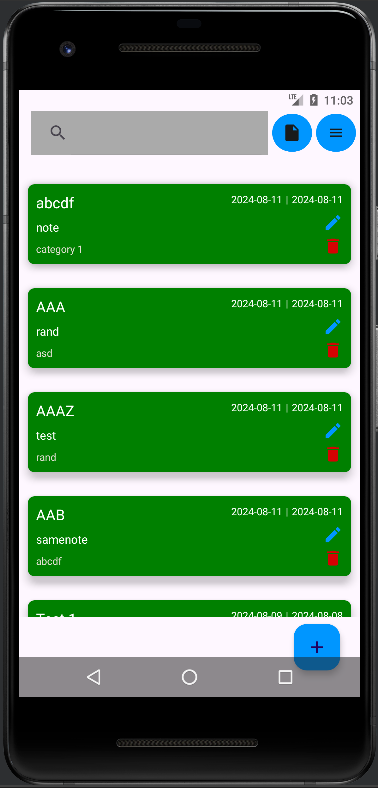

# Notes-App
## Description
A simple android notes app made using Kotlin. You can create, update, read, and delete notes. Sort notes by title, created date, or updated date using Quick Sort Algorithm or Selection Sort Algorithm. Search notes by title and/or notes or filter them by category using Knuth Morris Pratt or Boyer Moore Algorithm.  

## Executing program
1. Download the "app-release.apk" from the "app/release/" folder
2. Scan and install the app on your phone or emulator
3. Open the app
  
## Technologies Used
* Kotlin Programming Language
* Room Database
* Android Studio

## Minimum Requirements
* Android SDK 24 or above

## Sorting Algorithms Used
The program uses two sorting algorithms for sorting notes: **Quick Sort** and **Selection Sort**. Quick Sort is used for it's generally fast sorting time, while Selection Sort is used as a comparison for Quick Sort. Quick Sort is a sorting algorithm based on partitioning array into two arrays of relatively equal sizes. Quick Sort is best used when the pivot is the median of the array as it leads to an optimal partitioning. However, it is performs badly when the array is already sorted as it leads to an unbalanced partitioning. Selection Sort works by finding the maximum of the array, swapping it with the _head_ of the array, and then Selection Sorting the resulting _tail_. It can be viewed as a unique case of Quick Sort where instead of partitioning the array into two arrays of relatively equal sizes, it partitions the array into a 1 element and n-1 element arrays. Because of that, Selection Sort is generally worse than Quick Sort.

## String Matching Algorithm Used
The program uses two String Matching Algorithm for queries and filter: **Knuth-Morris-Pratt (KMP)** and **Boyer-Moore (BM)**. Knuth-Morris-Pratt Algorithm works similarly to a brute force algorithm except that it shifts the pattern more intelligently. KMP is good at reading large strings/files as it never moves backwards. However, it doesn't perform well when the size of the alphabet or character variance is large. Boyer-Moore Algorithm is a string matching algorithm based on the looking-glass and character-jump technique. It looks for the last occurence of a character from the String in the Pattern and tries to shift the pattern accordingly. Boyer-Moore works better when the size of the alphabet or character variance is large as it allows for large _jumps_. However, it is worse when the size of the alphabet or character variance is small because the _jump_ distance gets smaller.

## Screenshots
* Main Menu

* Create Dialog

* Update Dialog

* Settings Menu

* Export/Import Menu

  
## Authors
Ariel Herfrison

## Acknowledgments/References
* [String-Matching-and-Sorting-Algorithms](https://informatika.stei.itb.ac.id/~rinaldi.munir/Stmik/2023-2024/stima23-24.htm)
* [Room-CRUD](https://www.youtube.com/watch?v=r_UfOz3yaLg)
* [Excel-Export-in-Android](https://www.youtube.com/watch?v=9xCI5NCFNgE)
* [Android-Dropdown-Menu](https://www.youtube.com/watch?v=741l_fPKL3Y&t=351s)
